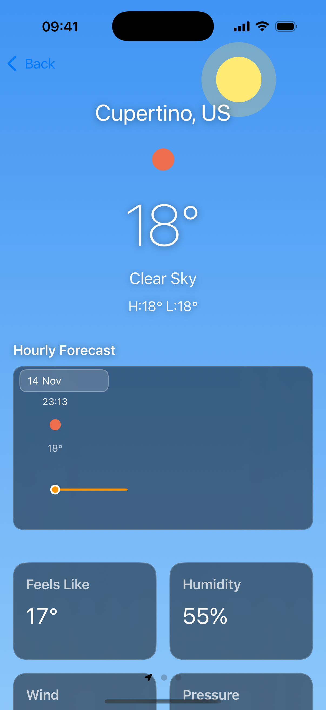
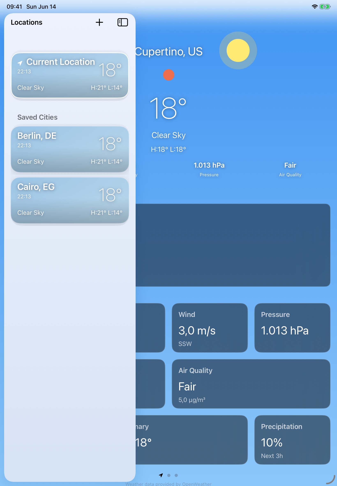

# WeatherForecast

A weather app for iPhone and iPad, written in UIKit with no third-party
dependencies. It shows the current conditions for your location and any cities
you save, an hourly temperature graph drawn with a custom collection view
layout, and a grid of detail tiles you can drag around and hide.

I built it to see how far you can push plain UIKit: custom layouts, manual
frame math, Swift Concurrency, and a clean MVVM split, without reaching for
SwiftUI or a single pod.

## Screenshots

| iPhone | iPad |
| --- | --- |
|  |  |

The iPhone shows the main weather screen: animated sky, current summary, the
hourly graph with its sticky day header, and the tile grid. The iPad shows the
split layout with the locations sidebar over the detail, plus the wider summary
and extra tiles that only appear when there's room.

## What it does

- Current weather for your device location, with a permission screen and an
  **Open Settings** shortcut when access is denied.
- Save, reorder (drag), and delete (swipe) cities. Search is powered by MapKit,
  so you get coordinates without another API key.
- Swipe left/right on the weather screen to move between saved locations; it
  stays in sync with the list.
- An hourly temperature graph that joins across cells into one continuous
  Catmull-Rom curve, with the dot for each hour sitting exactly on the line.
- Detail tiles in a Windows-10-style grid: long-press to drag and reorder, and
  the order is saved between launches. More tiles show on iPad, fewer on a
  phone or a narrow split-screen window.
- Pull to refresh, an offline banner that retries when you reconnect, and an
  on-disk cache so the last result is there instantly on the next launch.
- Adapts to iPad multitasking and rotation: the graph re-lays out without
  reloading, and the tiles reflow to the available space.

## How it's put together

The code is split in two:

- **`WeatherCore`** is a local Swift package holding everything testable: the
  models, view models, networking, storage, display mapping, and the graph/tile
  layout geometry. It's plain Foundation, uses `async/await` and `actor`s, and
  has no UIKit import.
- **`WeatherApp`** is the iOS target. The view controllers are passive: they
  render whatever state a view model hands them and forward user input back.

A few decisions worth calling out:

- **UIKit only.** No SwiftUI, no Combine, no storyboards or xibs; every view is
  built in code.
- **The temperature graph** uses a hand-written `UICollectionViewLayout`
  subclass (not flow or compositional layout) so the curve, the centred dots,
  and the horizontal sticky day headers all line up.
- **The tile grid** is laid out with manual frame math (no Auto Layout, no
  stack views), which is what makes the drag-to-reorder feel stable.
- **The API key never ships in the app.** The app talks only to a small
  Cloudflare Worker (`weather-proxy/`) over HTTPS, and the Worker adds the
  OpenWeatherMap key on its side. `Config.plist` just holds the proxy URL.

## Getting started

You'll need Xcode 16+ (the project targets iOS 18). The generated project is
checked in, so it's just:

```bash
open WeatherApp.xcworkspace
```

Then pick a simulator and run. `Config.plist` already points at a live proxy,
so it works out of the box. If you fork it and want your own backend, copy
`WeatherApp/Resources/Config.plist.example` to `Config.plist` and set
`WeatherProxyBaseURL` to your Worker.

The project is defined in `project.yml` and generated with
[XcodeGen](https://github.com/yonaskolb/XcodeGen); only re-run
`xcodegen generate` if you change that file.

To deploy your own proxy, set an `OWM_API_KEY` secret on the Worker in
`weather-proxy/` and publish it with `wrangler`.

## Tests

`WeatherCore` is covered by unit tests for networking, the view models, the
layout geometry, and storage (run with `cd WeatherCore && swift test`). The app
target adds UIKit-layer and snapshot tests, and there's a deterministic UI test
suite that runs against seeded fixtures via the `-uiTesting` launch argument.

```bash
cd WeatherCore && swift test          # the package
# or run the WeatherApp scheme's tests from Xcode for the full set
```

SwiftLint runs clean; a custom rule keeps Xcode's file-header boilerplate out.

## Layout

```
WeatherApp/        iOS target: view controllers, views, custom layouts
WeatherCore/       Swift package: models, view models, networking, storage
WeatherAppTests/   unit + snapshot tests for the app layer
WeatherAppUITests/ end-to-end UI tests
weather-proxy/     Cloudflare Worker that fronts the OpenWeatherMap API
```

## License

MIT. See [LICENSE](LICENSE).
